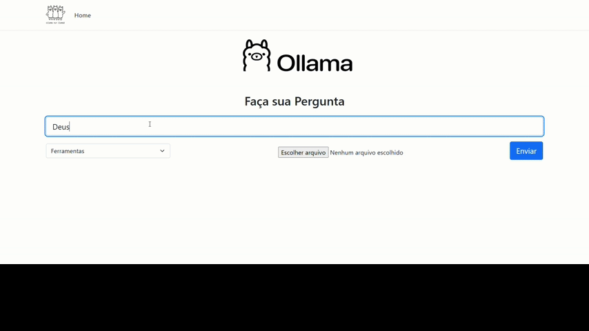

# Pergunte ao Llama - Sistema de perguntas ao modelo de IA Llama 3 

## Sobre
O projeto foi desenvolvido durante o 5° semestre do curso de Analise e Desenvolvimento de Sistemas, dentro da disciplina de Tópicos Especiais.

O sistema "Pergunte ao Llama" atua como uma aplicação web, disponibilizando uma interface de interação através de texto que permite ao usuário fazer perguntas e obter respostas do model de IA LLAMA 3. 

## Tecnologias
- C#
- ASP.NET Core Razor Pages.
- Llama 3
- JavaScript + AJAX
- Bootstrap

## Funcionalidades
- Pergunta tradicional: O usuário faz uma pergunta e obtem uma resposta sem limitações ou regras aplicadas.
- Explicar termo: A resposta é dada de maneira a explicar o termo de forma conceitual, limitando a resposta em no máximo 100 palavras.
- Analise de Sentimento: O llama analisa a frase e responde de forma clara e objetiva se ela é positiva, negatina ou neutra.
- Resumir Conteúdo: O arquivo .Txt anezado e enviado é interpretado e seu conteúdo é retornado de forma resumida na resposta.
- Ouvir resposta: Toda resposta obtida pode ser ouvida através da função de aúdio.

## Capturas de tela 

### Página Inicial da Aplicação
Visual minimalista e intuitívo.

### Demonstração 
Utilização da funcionalidade "Explique o Termo"

